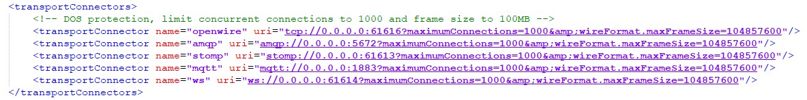

# ActiveMQ

## ActiveMQ的安装和使用

  1. [ActiveMQ下载地址](http://activemq.apache.org/ )
  2. 如果是源码包。需要用maven进行编译
  3. 如果是二进制包，这直接解压使用即可
  4. 查看conf目录下的[activemq.xml](../files/activemq.xml)
  (如果你选择的版本不同，可能需要做出修改)
  5. 进入bin目录，执行
  ```shell
  ./activemq start # 即可执行
  ```
