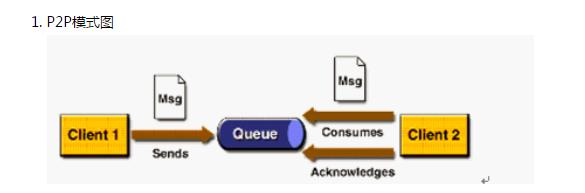
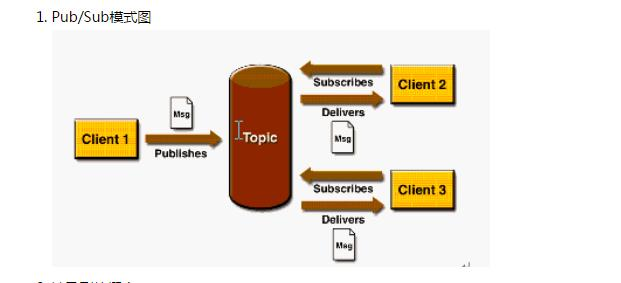

# JMS

## 介绍
    JMS即Java消息服务（Java Message Service）应用程序接口，是一
    个Java平台中关于面向消息中间件（MOM）的API，用于在两个应用程序之间，或分布式系统中发送消息，进行异步通信。Java消息服务是一个与具体平台无关的API，绝大多数MOM提供商都对JMS提供支持。
## JMS 消息模型
  JMS支持企业消息产品提供两种主要的消息风格：
    - Point-to-Point（P2P）
    - Publish/Subscribe（Pub/Sub）

### P2P
  1. 点对点消息风格允许一个客户端通过一个叫“队列”的中间抽象发送一个消息给另一个客户端。发送消息的客户端将一个消息发送到执行的队列中，接收消息的客户端从这个队列中抽取消息。

  
  2. p2p特点
    - 每个消息只有一个消费者（Consumer）(即一旦被消费，消息就不再在消息队列中)
    - 发送者和接收者之间在时间上没有依赖性，也就是说当发送者发送了消息之后，不管接收者有没有正在运行，它不会影响到消息被发送到队列
    - 接收者在成功接收消息之后需向队列应答成功

    *** 如果你希望你发送的内个消息都应该被成功处理的话，就使用p2p模式***

### Pub/Sub
  1. 发布订阅（Publish/Subscribe，Pub/Sub）消息风格则允许一个客户端通过一个叫“主题（topic）”的中间抽象发送一个消息给多个客户端。发送消息的客户端将一个消息发布到指定的主题中，然后这个消息将被投递到所有订阅了这个主题的客户端。

  

  2. Pub/Sub 特点
    - 每个消息可以有多个消费者
    - 发布者和订阅者之间有时间上的依赖性。针对某个主题（Topic）的订阅者，它必须创建一个订阅者之后，才能消费发布者的消息，而且为了消费消息，订阅者必须保持运行的状态。
    - 为了缓和这样严格的时间相关性，JMS允许订阅者创建一个可持久化的订阅。这样，即使订阅者没有被激活（运行），它也能接收到发布者的消息。

    ***如果你希望发送的消息可以不被做任何处理、或者被一个消息者处理、或者可以被多个消费者处理的话，那么可以采用Pub/Sub模型***
