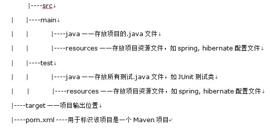
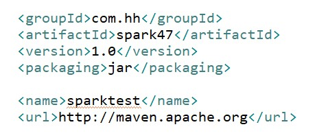

# Maven

## Maven 是什么？
  > Maven(翻译为"专家"，"内行")是跨平台的项目管理工具。主要服务于基于Java平台的项目构建，依赖管理和项目信息管理。

  > 在这里，我的个人感觉，maven就是一个能更好的帮助你组织项目结构的工具

## Maven构建项目的过程
  > 项目构建过程包括【清理项目】→【编译项目】→【测试项目】→【生成测试报告】→【打包项目】→【部署项目】这几个步骤，这六个步骤就是一个项目的完整构建过程。

## Maven的简单使用

 ### 1. maven的目录约定
  
 ### 2. maven pom.xml文件必备内容
  
 ### 3. maven 命令
``` shell
mvn clean  # 清理
mvn compile # 编译
mvn test # 测试
mvn package # 打包
mvn install # 同步到仓库
mvn site   # 站点信息，此命令很少使用
```
## Maven 仓库
    根据maven坐标定义每个构建在仓库中唯一存储路径。
    例如：路径为：groupId/ artifactId/version/ artifactId-version.packaging
	http://search.maven.org  从中央仓库中搜索jar包

 - 仓库的分类
  - 本地仓库(only one)：默认路径为/.m2/repository
  - 远程仓库：例如中央仓库、私服、镜像等

## Maven 三大生命周期
  Maven有三套相互独立的生命周期，请注意这里说的是“三套”，而且“相互独立”，这三套生命周期分别是：

  - Clean：在进行真正的构建之前进行一些清理工作。
  - Default：构建的核心部分，编译，测试，打包，部署等等。
  - Site：生成项目报告，站点，发布站点。

## Maven聚合和继承
  - 继承关系：（在pom.xml文件配置）
    ``` xml
    <parent>
    <groupId>com.dongnao.jack</groupId>
    <artifactId>parent</artifactId>
    <version>0.0.1-SNAPSHOT</version>
    <relativePath>../parent</relativePath>
    </parent>

    ```

  - 聚合
    ``` xml
    <modules>
  		<module>hello1Maven</module>
  		<module>maven1</module>
  	</modules>

    ```
  - 特殊标签中的关系
    -  dependencyManagement中定义的依赖子module不会共享
    -  dependencies中定义的依赖子module可以共享
-----------------

## maven更新遇到错误的时候处理方案
    was cached in the local repository, resolution will not
    be reattempted until the update interval of nexus has
    elapsed or updates are forced
***去自己的.m2 文件夹下把 xxx.lastUpdated文件全部删掉，重新运行maven，ok！***
