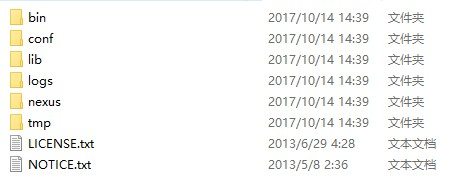

# Nexus

## Nexus 私服
  1. 下载地址：http://www.sonatype.org/nexus/
  2. 搭建好nexus的时候，此时的nexus就可以当作一个maven的远程仓库

## Nexus 内置仓库说明
  1. Hosted：本地仓库，宿主仓库
  2. Maven Central：该仓库代理maven中央仓库，其策略为Release，因此只会下载和缓存中央仓库的发布版本构建。
  3. Releases：这是一种策略为Release的宿主类型仓库，用来部署组织内部的发布版本构件。
  4. Snapshots：这是一个策略为Snapshot的宿主类型仓库，用来部署组织内部的快照版本构件。
  5. 3rd party：这是一个策略为Release的宿主类型仓库，用来部署无法从公共仓库获得的第三方发布版本构件。
  6. Public Repositories：该仓库组将上述所有策略为Release的仓库聚合并通过一致的地址提供服务。

## Nexus 使用说明
  1. 将下载好的压缩包，解压到自己喜欢的目录即可。
  2. 进入bin目录，windows下执行nexus.bat,linux下执行nexus即可
  3. 有关nexus的端口等配置文件可以在conf目录进行配置

  

## maven访问私服配置说明
  1. 进入maven的conf目录下

  

  2. 修改settings.xml文件，添加内容如下,在此，我提供settings的配置文件 [settings.xml](../files/settings.xml)

```xml
<mirror>
   <!--此处配置所有的构建均从私有仓库中下载 *代表所有，也可以写central -->
   <id>nexus</id>
   <mirrorOf>*</mirrorOf>
   <name>aliyun nexus</name>
   <url>http://maven.aliyun.com/nexus/content/groups/public</url>
</mirror>

    <profile>
		 <id>nexus</id>
		 <!--所有请求均通过镜像 -->
		 <repositories>
			 <repository>
				 <id>central</id>
				 <url>http://central</url>
				 <releases><enabled>true</enabled></releases>
			 	 <snapshots><enabled>true</enabled></snapshots>
			 </repository>
		 </repositories>
		 <pluginRepositories>
			 <pluginRepository>
				 <id>central</id>
				 <url>http://central</url>
				 <releases><enabled>true</enabled></releases>
				 <snapshots><enabled>true</enabled></snapshots>
			 </pluginRepository>
		 </pluginRepositories>
	 </profile>
```
