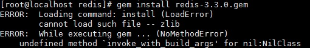
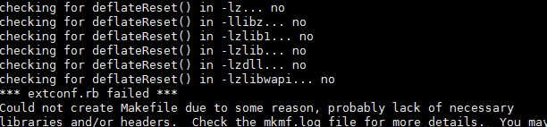
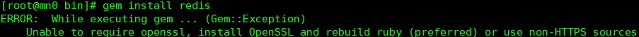
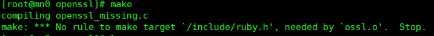

# redis on ruby

## ruby 环境搭建
  1. redis的集群是交给ruby-trib.rb来管理的.也就是说需要ruby的运行环境。[download ruby](http://www.ruby-lang.org/en/downloads/).
  2. 我使用的ruby版本是2.4.2，下载是的源码包，需要自己编译
  3. 开始编译
  ``` shell
  # 进入ruby目录
  ./configure --prefix=/path/to/finename
  make
  make install
  ```
  4. 现在需要使用gem来下载redis的相关api
  ``` shell
  ./gem install redis # 开始我以为能成功，事实上，我想错了
  ```
  
  > 如果出现以上问题，则使用

  ``` shell
  yum install zlib zlib-devel -y # 下载相关依赖及开发工具包
  cd $RUBY_SRC_HOME/ext/zlib
  ruby extconf.rb # 表示很无力吐槽，我艹。。。
  make&&make install
  ```
  > 但是你可能遇到一下问题

  

  ```shell
  # 修改前面的这条命令即可
  ruby extconf.rb  --with-zlib-include=/usr/local/zlib/include/ --with-zlib-lib=/usr/local/zlib/lib
  ```

  > 然而你make的时候可能会遇到下面的问题= =

  ```shell
  make: *** No rule to make target `/include/ruby.h', needed by `zlib.o'.  Stop
  ```
  > 修改Makefile文件

  ```shell
  vim Makefile
  # 在开始部分添加一下内容
  top_srcdir=path/to/ruby/src
  # 然后执行
  make&&make install
  ```
  > 嗯，你以为你现在就能成功了吗？错了，哈哈

  ```shell
  # 当你再次下载redis的时候
  gem install redis
  ```
  > 你可能会出现一下错误

  

  ```shell
  yum install openssl openssl-devel -y
  cd $RUBY_SRC_HOME/ext/openssl
  ruby extconf.rb  --with-openssl-include=/usr/local/openssl/include/ --with-openssl-lib=/usr/local/openssl/lib
  make && make install
  ```
  > make 还是会出现类似的错误

  

  > 修改策略同zlib

  ```shell
  gem install redis # 现在就好了，想哭
  ```
