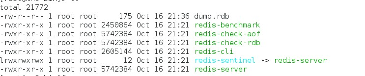
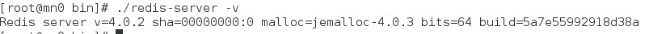

# redis

## redis 简介
    redis是一个开源免费的高性能key-value数据库。
----
  **key-value数据库介绍**

Key-value数据库是一种以键值对存储数据的一种数据库，类似java中的map。可以
将整个数据库理解为一个大的map，每个键都会对应一个唯一的值。Key-value数据
库代表的有redis。Redis是一个Key-Value存储系统。和Memcached类似，它支持
存储的value类型相对更多，包括string(字符串)、list(链表)、set(集合)
和zset(有序集合)。另外redis是一种内存型的数据库，所以可以对外提供很好地
读写操作，但是同样也暴露出内存占用高，数据持久化不易等问题。
----
## redis和其他key-value数据库的特点：
  1. Redis支持数据的持久化，可以将内存中的数据保存在磁盘中，重启的时候可以再次加载进行使用。
  2. Redis不仅仅支持简单的key-value类型的数据，同时还提供list，set，zset，hash等数据结构的存储。
  3. Redis支持数据的备份，即master-slave模式的数据备份。

## redis 安装（linux下面,版本说明请看README.md）
  1. [redis下载地址](http://download.redis.io/releases)
  2. 将下载的压缩包解压
  ```shell
  tar -zxvf redis-xx.tar.gz
  ```
  3. 因为下载的不是二进制包，嗯，也就是说，你需要自己编译，所以你需要gcc，make等编译工具
  ```shell
  yum install -y gcc make # 如果没有的话，建议执行这个命令进行仓库安装
  ```
  4. 进入redis的目录，我使用的版本为4.0.2
  ```
  make&&make install
  # 如果要将命令（这里为啥叫命令后面会解释）放到指定目录，则使用一下命令
  make PREFIX=/path/to/dirname install
  # 如果是32为机器，建议参照目录下面的README.md进行安装
  make 32bit&& make install
  ```
  5. 安装错误的话一般是缺少依赖或者版本不对应的原因，再次不多赘述，网上有很多资料支持

  6. 安装完成后，应该会看到以下命令
  

  7. 使用以下命令可以测试redis是否安装成功
  ```shell
  ./redis-server -v
  ```
  

## redis 使用(单机模式)
