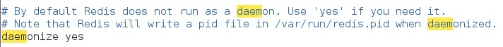
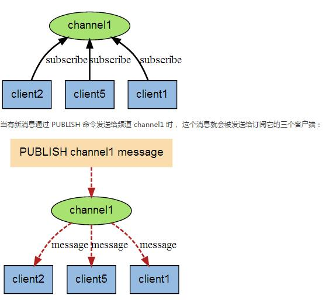
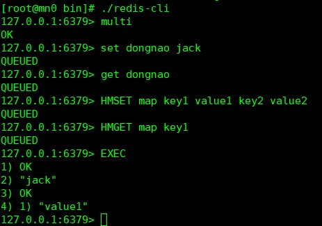
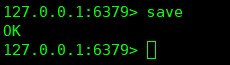

# redis

## redis 简介
    redis是一个开源免费的高性能key-value数据库。
----
  **key-value数据库介绍**

Key-value数据库是一种以键值对存储数据的一种数据库，类似java中的map。可以
将整个数据库理解为一个大的map，每个键都会对应一个唯一的值。Key-value数据
库代表的有redis。Redis是一个Key-Value存储系统。和Memcached类似，它支持
存储的value类型相对更多，包括string(字符串)、list(链表)、set(集合)
和zset(有序集合)。另外redis是一种内存型的数据库，所以可以对外提供很好地
读写操作，但是同样也暴露出内存占用高，数据持久化不易等问题。
----
## redis和其他key-value数据库的特点：
  1. Redis支持数据的持久化，可以将内存中的数据保存在磁盘中，重启的时候可以再次加载进行使用。
  2. Redis不仅仅支持简单的key-value类型的数据，同时还提供list，set，zset，hash等数据结构的存储。
  3. Redis支持数据的备份，即master-slave模式的数据备份。

## redis 安装（linux下面,版本说明请看README.md）
  1. [redis下载地址](http://download.redis.io/releases)
  2. 将下载的压缩包解压
  ```shell
  tar -zxvf redis-xx.tar.gz
  ```
  3. 因为下载的不是二进制包，嗯，也就是说，你需要自己编译，所以你需要gcc，make等编译工具
  ```shell
  yum install -y gcc make # 如果没有的话，建议执行这个命令进行仓库安装
  ```
  4. 进入redis的目录，我使用的版本为4.0.2
  ```shell
  make&&make install
  # 如果要将命令（这里为啥叫命令后面会解释）放到指定目录，则使用一下命令
  make PREFIX=/path/to/dirname install
  # 如果是32为机器，建议参照目录下面的README.md进行安装
  make 32bit&& make install
  ```
  5. 安装错误的话一般是缺少依赖或者版本不对应的原因，再次不多赘述，网上有很多资料支持

  6. 安装完成后，应该会看到以下命令（此处就是可以指定命令安装的位置）
  

  7. 使用以下命令可以测试redis是否安装成功
  ```shell
  ./redis-server -v
  ```
  

## redis 使用(单机模式)
  1. redis读取的是[redis.conf](../files/redis.conf)作为初始化信息
  2. 当启动redis的时候，使用bin目录下面的
  ```shell
  ./redis-server redis.conf # 后面不加参数的话，则使用默认的参数，简体添加参数
  ```
  3. 默认启动的时候，使用的前台模式，即运行在前台，如果想运行在后台，请修改配置文件redis.conf的参数如下：
  
  4. 通过客户端登录
  ```shell
  ./redis-cli #活人就是hist：127.0.0.1 post：6379
  redis> ping
  PONG
  redis> set foo bar
  OK
  redis> get foo
  "bar"
  redis> incr mycounter
  (integer) 1
  redis> incr mycounter
  (integer) 2
  redis>
  ```
  你可以在这个网址查看更多命令操作： http://redis.io/commands.

## redis 发布订阅
  1. redis发布订阅（pub/sub）是一种消息通信模式：发送者发送消息，订阅者接收消息
  

  单机模式下例子如下：
  ```shell
  # 第一个窗口
  ./redis-cli
  redis> subscribe title # 订阅的主题

  # 第二个窗口
  ./redis-cli
  redis> publish title message # 发送消息给订阅者
  ```

## redis 事务
  1. redis事务可以一次执行多个命令，并且带有以下两个重要保证：
    - 事务是一个单独的隔离操作：事务中的所有命令都会序列化、按顺序地执行。事务在执行的过程中，不会被其他客户端发送来的命令请求所打断。
    - 事务是一个原子操作：事务中的命令要么全部被执行，要么全部都不执行。

  2. 一个事务从开始到执行会经历以下三个阶段：
    - 开始事务。
    - 命令入队。
    - 执行事务。

    例子如下所示：

    

## redis数据进行备份和恢复
  > 默认情况下 每隔一段时间redis服务器程序会自动对数据库做一次遍历，把内存快照写在一个叫做“dump.rdb”的文件里，这个持久化机制叫做SNAPSHOT。有了SNAPSHOT后，如果服务器宕机，重新启动redis服务器程序时redis会自动加载dump.rdb，将数据库状态恢复到上一次做SNAPSHOT时的状态。

  > 手动进行内存备份：Save

  

## redis 安全

```shell
redis> config get requirepass # get password
redis> config set requirepass 111 # set password
redis> auth 111 # auth password
```

## redis 主从模式配置
  1. 将编译好的redis放入另一台服务器中，请将redis.conf一起带过去。
  2. 修改[redis.conf](../files/redis.conf)文件
  ```shell
  bind 127.0.0.1 # 修改为本机的ip地址
  slaveof masterip masterport # 在slave节点上修改
  # 启动时请使用
  ./redis-server redis.conf
  ```
